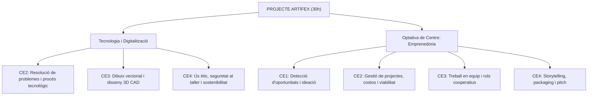
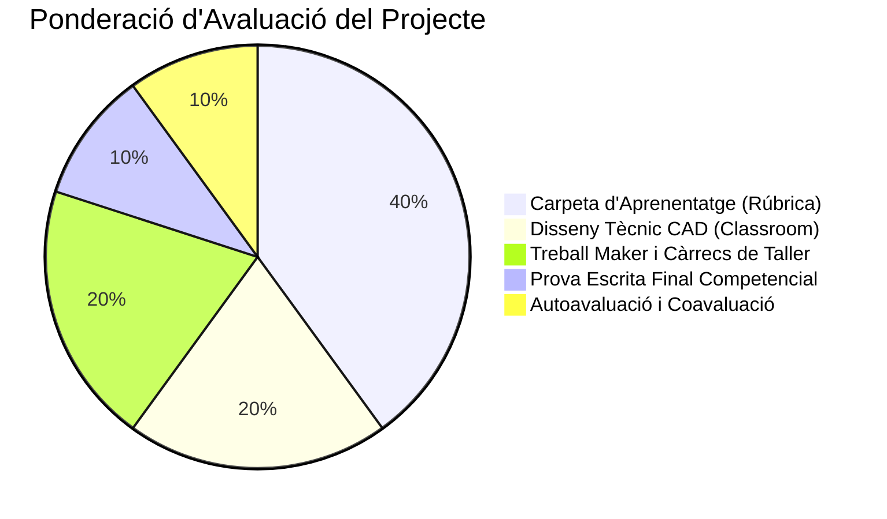

# 🧭 GUIA DOCENT I PROGRAMACIÓ DIDÀCTICA: PROJECTE ARTÍFEX

<div class="custom-card" style="border-left: 5px solid var(--sl-color-accent); background: rgba(193, 40, 114, 0.04); padding: 1.25rem; border-radius: 12px; margin: 1.5rem 0;">
  <h3 style="margin-top: 0; color: var(--sl-color-accent-high); font-size: 1.25rem;">✨ Dades Generals del Projecte</h3>
  <ul style="margin-bottom: 0; font-size: 0.95rem; line-height: 1.6;">
    <li><strong>Nom del Projecte:</strong> Artífex — Disseny, Fabricació Digital i Emprenedoria Cooperativa de Joieria</li>
    <li><strong>Nivell educatiu:</strong> 2n d'ESO (Projecte Comunitari / Tecnològic i Optativa de Centre)</li>
    <li><strong>Àmbits i Matèries implicades:</strong> Tecnologia i Digitalització & Optativa de Centre en Emprenedoria (Decret 175/2022)</li>
    <li><strong>Durada total:</strong> 30 hores lectives (sessions d'1 hora)</li>
    <li><strong>Organització de l'alumnat:</strong> Equips cooperatius de 3 membres amb rols maker rotatius/assignats</li>
  </ul>
</div>

---

## 🎯 1. PROPÒSIT, REPTE I OBJECTIUS D'APRENENTATGE

### 💡 Propòsit del Projecte
Impulsar el creixement personal i col·lectiu de l'alumnat utilitzant la **creació d'una cooperativa escolar de joieria** com a mitjà per treballar el disseny, la fabricació digital i els processos artesanals de taller, així com l'empatia, la responsabilitat compartida, la presa democràtica de decisions, la cura pel detall i la resiliència davant la frustració i l'error.

### ❓ Pregunta Essencial (El Repte)
> **Com podem transformar una idea i un record en una marca de joieria viable i comercialitzable utilitzant el disseny, la fabricació digital i l'emprenedoria cooperativa?**

### 🎯 Objectius d'Aprenentatge
1. **Concebre i materialitzar una identitat de marca cooperativa**, aplicant estratègies d'ideació (*Design Thinking*), tècniques de *naming*, disseny gràfic de logotip i comunicació visual.
2. **Integrar eines de disseny assistit per ordinador i fabricació digital** (modelat 2D vectorial, disseny 3D paramètric amb Tinkercad i Codeblocks, impressió 3D) amb **processos manuals i artesanals de taller** (encofrat de fusta, motlles de silicona líquida, buidatge de resina epoxi, polit de precisió i muntatge de joieria).
3. **Impulsar i gestionar una cooperativa escolar**, comprenent el cicle complet de vida del producte: des de la recerca de mercat i el disseny fins a l'estudi de costos, el càlcul del punt d'equilibri (*break-even*), el packaging, l'storytelling de marca i la comercialització.
4. **Fomentar el treball en equip cohesionat i responsable**, assumint rols *maker* concrets (*Seguretat*, *Ordre/Eines/Residus*, *Focus/Temps/Clima*), establint acords interns i resolent conflictes mitjançant el consens i la coavaluació entre iguals.
5. **Desenvolupar l'autoregulació i el pensament crític**, utilitzant la Carpeta d'aprenentatge com a eina de reflexió continuada, valorant la qualitat dels acabats i acceptant l'error com una oportunitat indispensable d'aprenentatge.

---

## 🏛️ 2. MARC CURRICULAR I NORMATIU (DECRET 175/2022)

El projecte Artífex s'emmarca en el currículum de l'Educació Secundària Obligatòria a Catalunya (**Decret 175/2022, de 27 de setembre**), articulant de forma transversal la matèria de **Tecnologia i Digitalització** i l'**Optativa de Centre en Emprenedoria**.



### 📌 Regulació de l'Optativa de Centre «Emprenedoria» (1r-3r d'ESO)
En el marc del Decret 175/2022, les optatives de centre no disposen d'un codi curricular oficial tancat, sinó que el centre en redacta la programació didàctica a partir dels descriptors operatius del **Perfil Competencial de Sortida de l'ESO** i de les competències clau:

* **CE1 (Detectar necessitats i oportunitats):** Analitzar l'entorn per identificar necessitats socials, culturals i econòmiques, plantejant propostes de valor afegit.
* **CE2 (Planificar i gestionar projectes):** Dissenyar, organitzar i executar un pla d'empresa cooperativa (assignació de rols, gestió de temps, càlcul de costos i punt d'equilibri).
* **CE3 (Treball en equip i lideratge compartit):** Cooperar de manera assertiva, aplicant acords d'equip, gestionant càrrecs i resolent discrepàncies de forma democràtica.
* **CE4 (Comunicació, prototipatge i pitch):** Elaborar el prototip de producte, redactar la història de la marca (*storytelling*) i comunicar la proposta de valor al client.

---

## 📊 3. COMPETÈNCIES ESPECÍFIQUES, CRITERIS D'AVALUACIÓ I SABERS BÀSICS

### 🛠️ A) TECNOLOGIA I DIGITALITZACIÓ

<table style="width: 100%; border-collapse: collapse; margin: 1rem 0; font-size: 0.85rem; line-height: 1.4;">
  <thead>
    <tr style="background: #f8fafc; color: #1e293b; border-bottom: 2px solid #9d174d;">
      <th style="width: 32%; padding: 0.6rem; text-align: left; border: 1px solid #d1d5db;">Competències Específiques</th>
      <th style="width: 34%; padding: 0.6rem; text-align: left; border: 1px solid #d1d5db;">Criteris d'Avaluació</th>
      <th style="width: 34%; padding: 0.6rem; text-align: left; border: 1px solid #d1d5db;">Sabers Bàsics Relacionats</th>
    </tr>
  </thead>
  <tbody>
    <tr>
      <td style="padding: 0.6rem; border: 1px solid #d1d5db; vertical-align: top;">
        <strong>CE 2.</strong> Planificar, dissenyar i desenvolupar solucions a problemes tecnològics amb autonomia i actitud creativa, aplicant el procés tecnològic i treballant de manera cooperativa per resoldre necessitats de forma eficaç i sostenible.
      </td>
      <td style="padding: 0.6rem; border: 1px solid #d1d5db; vertical-align: top;">
        <strong>2.1.</strong> Dissenyar i crear solucions tecnològiques aplicant coneixements interdisciplinaris, pensament de disseny i tècniques de creativitat.<br/><br/>
        <strong>2.2.</strong> Seguir de forma rigorosa les etapes del procés tecnològic documentant-ne el desenvolupament a la carpeta d'aprenentatge.
      </td>
      <td style="padding: 0.6rem; border: 1px solid #d1d5db; vertical-align: top;">
        <strong>Bloc: Procés de resolució de problemes</strong><br/>
        • Estratègies i mètodes de disseny (esbossos, pluja d'idees).<br/>
        • Avaluació i optimització de solucions.<br/>
        • Documentació tècnica i memòria de fabricació.
      </td>
    </tr>
    <tr>
      <td style="padding: 0.6rem; border: 1px solid #d1d5db; vertical-align: top;">
        <strong>CE 3.</strong> Descriure, representar i intercanviar idees mitjançant eines digitals, dibuix vectorial i programari de disseny 3D (CAD), utilitzant simbologia i vocabulari tècnic normalitzat.
      </td>
      <td style="padding: 0.6rem; border: 1px solid #d1d5db; vertical-align: top;">
        <strong>3.1.</strong> Modelar digitalment en 2D el logotip de la marca amb aplicacions de dibuix vectorial.<br/><br/>
        <strong>3.2.</strong> Programar i generar peces tridimensionals paramètriques mitjançant blocs visuals (Tinkercad Codeblocks) i exportar fitxers per a impressió 3D (.STL).
      </td>
      <td style="padding: 0.6rem; border: 1px solid #d1d5db; vertical-align: top;">
        <strong>Bloc: Digitalització i CAD/CAM</strong><br/>
        • Aplicacions de disseny assistit per ordinador en 2D i 3D.<br/>
        • Programació basada en blocs aplicada al modelatge tridimensional.<br/>
        • Preparació de fitxers per a fabricació digital.
      </td>
    </tr>
    <tr>
      <td style="padding: 0.6rem; border: 1px solid #d1d5db; vertical-align: top;">
        <strong>CE 4.</strong> Fer un ús segur, ètic, responsable i sostenible dels materials, les eines i les màquines al taller maker, aplicant les normes de prevenció de riscos i respectant el medi ambient.
      </td>
      <td style="padding: 0.6rem; border: 1px solid #d1d5db; vertical-align: top;">
        <strong>4.1.</strong> Manipular materials químics (resina epoxi, silicona líquida) i eines de taller utilitzant els equips de protecció individual (guants, mascareta, ulleres).<br/><br/>
        <strong>4.2.</strong> Mantenir l'ordre, la neteja de motlles i la gestió selectiva de residus al banc de treball.
      </td>
      <td style="padding: 0.6rem; border: 1px solid #d1d5db; vertical-align: top;">
        <strong>Bloc: Materials i Fabricació</strong><br/>
        • Propietats dels polímers (silicones i resines termoestables).<br/>
        • Tècniques de conformat: impressió 3D FDM, encofrat i motlles.<br/>
        • Seguretat, higiene i gestió responsable de residus.
      </td>
    </tr>
  </tbody>
</table>

---

### 💡 B) OPTATIVA DE CENTRE: EMPRENEDORIA (1r - 3r d'ESO)

<table style="width: 100%; border-collapse: collapse; margin: 1rem 0; font-size: 0.85rem; line-height: 1.4;">
  <thead>
    <tr style="background: #f8fafc; color: #1e293b; border-bottom: 2px solid #9d174d;">
      <th style="width: 32%; padding: 0.6rem; text-align: left; border: 1px solid #d1d5db;">Competències Específiques d'Optativa</th>
      <th style="width: 34%; padding: 0.6rem; text-align: left; border: 1px solid #d1d5db;">Criteris d'Avaluació</th>
      <th style="width: 34%; padding: 0.6rem; text-align: left; border: 1px solid #d1d5db;">Sabers Bàsics Relacionats</th>
    </tr>
  </thead>
  <tbody>
    <tr>
      <td style="padding: 0.6rem; border: 1px solid #d1d5db; vertical-align: top;">
        <strong>CE_EMP 1.</strong> Detectar oportunitats d'innovació i idear propostes de valor singulars a partir de referents emocionals, culturals i d'entorn, creant una identitat de marca distintiva.
      </td>
      <td style="padding: 0.6rem; border: 1px solid #d1d5db; vertical-align: top;">
        <strong>1.1.</strong> Elaborar un Moodboard personal i transferir-ne els conceptes clau a una proposta de marca d'equip.<br/><br/>
        <strong>1.2.</strong> Aplicar les 5 Regles d'Or del Naming i dissenyar una col·lecció coherent de joies.
      </td>
      <td style="padding: 0.6rem; border: 1px solid #d1d5db; vertical-align: top;">
        <strong>Bloc 1: Generació d'idees i creativitat</strong><br/>
        • Metodologia <em>Design Thinking</em> (Empatitzar, Definir, Idear).<br/>
        • Mapes d'inspiració (Moodboard) i associació d'idees.<br/>
        • Tècniques de creació de marca (Naming i narrativa).
      </td>
    </tr>
    <tr>
      <td style="padding: 0.6rem; border: 1px solid #d1d5db; vertical-align: top;">
        <strong>CE_EMP 2.</strong> Gestionar els recursos materials i financers d'una cooperativa escolar, calculant costos de producció, preu de venda i punt d'equilibri per garantir la viabilitat econòmica.
      </td>
      <td style="padding: 0.6rem; border: 1px solid #d1d5db; vertical-align: top;">
        <strong>2.1.</strong> Distingir entre costos fixos (eines/motlles) i costos variables (resina, fornitures).<br/><br/>
        <strong>2.2.</strong> Interpretar el gràfic del simulador financer i consensuar el preu de venda en assemblea cooperativa.
      </td>
      <td style="padding: 0.6rem; border: 1px solid #d1d5db; vertical-align: top;">
        <strong>Bloc 2: Economia social i gestió de recursos</strong><br/>
        • Model d'emprenedoria cooperativa i assemblea.<br/>
        • Estudi de costos de fabricació (artesanal vs. industrial).<br/>
        • Simulació financera, marge de benefici i llindar de rendibilitat (<em>Break-even</em>).
      </td>
    </tr>
    <tr>
      <td style="padding: 0.6rem; border: 1px solid #d1d5db; vertical-align: top;">
        <strong>CE_EMP 3.</strong> Treballar cooperativament en equips de 3 persones de manera assertiva i cohesionada, exercint càrrecs de responsabilitat maker i complint els acords establerts.
      </td>
      <td style="padding: 0.6rem; border: 1px solid #d1d5db; vertical-align: top;">
        <strong>3.1.</strong> Complir les funcions assignades al càrrec maker (Seguretat, Ordre/Residus, Focus/Clima).<br/><br/>
        <strong>3.2.</strong> Participar en les aturades de seguiment intermedi i realitzar una coavaluació constructiva dels companys/es.
      </td>
      <td style="padding: 0.6rem; border: 1px solid #d1d5db; vertical-align: top;">
        <strong>Bloc 3: Treball en equip i lideratge</strong><br/>
        • Rols i càrrecs de responsabilitat maker.<br/>
        • Contracte d'equip, pacte d'acords i gestió de conflictes.<br/>
        • Avaluació entre iguals (Coavaluació) i autoregulació.
      </td>
    </tr>
    <tr>
      <td style="padding: 0.6rem; border: 1px solid #d1d5db; vertical-align: top;">
        <strong>CE_EMP 4.</strong> Comunicar eficaçment la proposta de valor del producte mitjançant el disseny del packaging, la targeta d'storytelling i la presentació pública de la marca.
      </td>
      <td style="padding: 0.6rem; border: 1px solid #d1d5db; vertical-align: top;">
        <strong>4.1.</strong> Redactar el relat de la marca (Story Card) connectant les emocions de l'equip amb el producte.<br/><br/>
        <strong>4.2.</strong> Presentar el Producte Mínim Viable i la col·lecció davant la comunitat educativa.
      </td>
      <td style="padding: 0.6rem; border: 1px solid #d1d5db; vertical-align: top;">
        <strong>Bloc 4: Prototipatge, packaging i pitch</strong><br/>
        • Validació del Producte Mínim Viable (PMV).<br/>
        • Narrativa de marca (<em>Storytelling</em>) i valor afegit.<br/>
        • Disseny d'embalatge (Packaging) i comunicació comercial.
      </td>
    </tr>
  </tbody>
</table>

---

## 🌟 4. COMPETÈNCIES CLAU I DESCRIPTORS DE SORTIDA

El projecte avalua i mobilitza directament els descriptors del **Perfil Competencial de Sortida de l'ESO**:

| Competència Clau | Descriptors Operatius Mobilitzats | Evidències d'Avaluació a Artífex |
| :--- | :--- | :--- |
| **CE (Competència Emprenedora)** | `CE1`, `CE2`, `CE3` | Creació de la marca, assemblea de cooperativa, càlcul financer i storytelling. |
| **STEM (Ciència, Tecnologia, Enginyeria)** | `STEM2`, `STEM3` | Modelat 3D a Tinkercad, impressió 3D, càlcul de volums i reaccions químiques de polimerització. |
| **CD (Competència Digital)** | `CD2`, `CD3`, `CD5` | Programació amb Codeblocks, vectorització 2D, ús de Tinkercad Classroom i simulador web. |
| **CPSAA (Personal, Social i Aprendre a Aprendre)** | `CPSAA1`, `CPSAA3`, `CPSAA5` | Portada, diari de la carpeta d'aprenentatge, gestió de la frustració, autoavaluació i coavaluació. |
| **CCL (Comunicació Lingüística)** | `CCL1`, `CCL2` | Redacció de l'Story Card, memòria de fabricació al taller i anàlisi crítica de conceptes. |
| **CCEC (Consciència i Expressió Culturals)** | `CCEC2`, `CCEC3` | Creació del Moodboard, disseny estètic de la col·lecció de joieria i anàlisi de referents d'art. |

---

## ⏱️ 5. TEMPORITZACIÓ DIDÀCTICA: CRONOGRAMA DE 30 HORES

Aquesta distribució planifica el projecte en **30 sessions lectives d'1 hora**, detallant els continguts, les eines utilitzades i les activitats corresponents a la web i a la Carpeta d'aprenentatge:

```mermaid
gantt
    title Cronograma del Projecte Artífex (30 Hores)
    dateFormat  X
    axisFormat H%X
    
    section Bloc Inicial i Ideació
    Presentació i Equips (H1-H2)          :active, 1, 2
    Fase 1: La Guspira i Moodboard (H3-H4) : 3, 4
    
    section Identitat Visual i Marca
    Fase 2: Naming i Logotips (H5-H8)     : 5, 8
    Fase 2: Col·lecció d'Arracades (H9-H10): 9, 10
    
    section Disseny Tècnic 2D/3D
    Fase 3: CAD 2D i Tinkercad (H11-H13)  : 11, 13
    Fase 3: Codeblocks 3D (H14-H15)       : 14, 15
    Aturada Seguiment d'Equip (H16)       : 16, 16
    
    section Producció al Taller Maker
    Fase 4: Impressió 3D i Encofrat (H17-H19): 17, 19
    Fase 4: Motlles Silicona (H20-H21)    : 20, 21
    Fase 4: Buidatge Resina Epoxi (H22-H23): 22, 23
    Fase 4: Polit i Muntatge (H24-H25)    : 24, 25
    
    section Economia, Storytelling i Tancament
    Fase 5: Costos i Simulador (H26-H27)  : 26, 27
    Fase 6: Storytelling i Packaging (H28): 28, 28
    Bloc 11: Autoavaluació i Tancament (H29-H30): 29, 30
```

---

### 📝 Seqüenciació Detallada Sessió a Sessió:

#### 🔹 BLOC 1: Introducció, Constitució de l'Equip i Ideació (Hores 1 a 4)
* **Hora 1: Presentació del Repte i Motivacions**
  * Presentació interactiva del projecte Artífex, el repte de la joieria i la cooperativa escolar.
  * Exploració de la web del projecte.
  * **Carpeta:** Portada, Rúbrica d'avaluació i *Activitat 1.1 (Presentació i Expectatives)*.
* **Hora 2: Habilitats Socioemocionals i Constitució d'Equips de 3**
  * Autoavaluació inicial de creativitat, cura del detall i gestió de l'error.
  * Activació de coneixements previs sobre joieria i empreses.
  * Creació dels equips de 3 alumnes i signatura del pacte d'equip.
  * **Carpeta:** *Activitats 1.2, 1.3 i 1.4 (Peticions, Aportacions, Acords i Assignació dels 3 Càrrecs Maker)*.
* **Hora 3: FASE 1 — La Guspira: Exploració de la Identitat Personal**
  * Navegació per la pàgina *FASE 1: La Guspira*. Reflexió sobre records, emocions, referents culturals i passions.
  * Pluja d'idees individual de conceptes, formes i textures.
  * **Carpeta:** *Activitat 2.1 (La Guspira Personal)*.
* **Hora 4: FASE 1 — Elaboració del Moodboard Individual**
  * Recerca d'imatges, tipografies i textures per crear el taulell d'inspiració visual.
  * Composició del Moodboard personal i síntesi dels 5 conceptes clau.
  * **Carpeta:** *Activitats 3.1 i 4.1 (Composició del Moodboard i Síntesi de Conceptes)*.

---

#### 🔹 BLOC 2: Identitat de Marca i Disseny Gràfic (Hores 5 a 10)
* **Hora 5: FASE 2 — Principis de Disseny Visual i Jurat de Disseny**
  * Treball dels criteris de contrast, llegibilitat, psicologia del color i tipografia.
  * Realització del test competencial del jurat de disseny.
  * **Carpeta:** *Activitat 6.1 (Qüestionari Jurat de Disseny)*.
* **Hora 6: FASE 2 — Naming: Les 5 Regles d'Or i Deliberació d'Equip**
  * Anàlisi de marques de referència a l'Atles de Naming.
  * Posada en comú de les 3 guspires dels membres de l'equip.
  * Pluja d'idees i elecció consensuada del nom comercial de la marca.
  * **Carpeta:** *Activitats 6.2 i 6.3 (Anàlisi de Noms i Elecció del Naming de l'Equip)*.
* **Hora 7: FASE 2 — Anàlisi Crítica de Logotips Mal Dissenyats**
  * Estudi dels casos reals d'errors gràfics (Ejido i Reykjavík Art Museum).
  * Aplicació de la Prova de les Tisores i Prova del Blanc i Negre (1 color).
  * **Carpeta:** *Activitat 6.4 (Anàlisi Crítica de Logotips Reals)*.
* **Hora 8: FASE 2 — Esbós del Logotip Oficial de l'Equip**
  * Pluja d'idees i esbossos a mà alçada de símbols per a la marca.
  * Deliberació i dibuix de l'esbós definitiu del logotip comú de l'equip apte per a tall de vinil/làser.
  * **Carpeta:** *Activitat 6.5 (Desenvolupament i Esbós del Logotip d'Equip)*.
* **Hora 9: FASE 2 — Disseny de la Col·lecció d'Arracades (Part 1)**
  * Definició de la font d'inspiració (natura, geometria, art) i de la coherència estètica de la línia.
  * Repartiment dels 3 models de la col·lecció (1 model per a cada alumne/a de l'equip).
  * **Carpeta:** *Activitat 6.6 (Esbossos de la Col·lecció d'Arracades)*.
* **Hora 10: FASE 2 — Disseny de la Col·lecció d'Arracades (Part 2) i Paleta de Colors**
  * Concreció dels 3 esbossos finals amb mides i justificació de la connexió amb la marca.
  * Definició de la paleta oficial de colors de resina i pigments.
  * **Carpeta:** Finalització de l'*Activitat 6.6*.

---

#### 🔹 BLOC 3: Disseny Tècnic CAD 2D i 3D Paramètric (Hores 11 a 16)
* **Hora 11: FASE 3 — Domini d'Eines 2D a Tinkercad (Tasca 1: Logo Munay)**
  * Connexió a Tinkercad Classroom.
  * Pràctica guiada: reproducció pas a pas del logotip Munay seguint el videotutorial de la web.
  * **Carpeta / Tinkercad:** Lliurament de la *Tasca 1 de Disseny Tècnic*.
* **Hora 12: FASE 3 — Vectorització del Logotip Oficial d'Equip (Tasca 2: Logo 2D)**
  * Modelat digital 2D del logotip oficial consensuat de l'equip a Tinkercad.
  * Verificació de dimensions (màx. 10 × 10 cm), unió de traços i exportació .SVG per a vinil/làser.
  * **Carpeta / Tinkercad:** Lliurament de la *Tasca 2 de Disseny Tècnic*.
* **Hora 13: FASE 3 — Introducció a Tinkercad Codeblocks (Programació 3D)**
  * Fonaments de la geometria computacional: variables, bucles, rotacions i operacions booleanes.
  * Primers exercicis de modelat paramètric amb blocs visuals.
* **Hora 14: FASE 3 — Programació 3D de l'Arracada de l'Equip (Tasca 3: Codeblocks)**
  * Cada membre programa la seva arracada assignada de la col·lecció utilitzant Codeblocks.
  * Ajust de gruixos (2-3 mm) i creació de l'orifici de subjecció per a l'anella (diàmetre 1,5-2 mm).
* **Hora 15: FASE 3 — Exportació STL i Preparació per a Impressió 3D**
  * Validació tècnica de les 3 arracades de l'equip (mida màx. 4 × 4 cm).
  * Exportació dels fitxers `.STL` i configuració de paràmetres al programari laminador (Slicer).
  * **Carpeta / Tinkercad:** Lliurament de la *Tasca 3 de Disseny Tècnic*.
* **Hora 16: SEGUIMENT INTERMEDI — Aturada de Reflexió d'Equip (Abans d'entrar al Taller)**
  * Revisió de l'estat de la carpeta abans d'iniciar la fabricació.
  * Avaluació del compliment dels acords i dels 3 càrrecs maker. Dinàmica *Dues estrelles i un desig*.
  * **Carpeta:** *Secció de Seguiment i Revisió d'Equip (Taules A, B, C i D)*.

---

#### 🔹 BLOC 4: Producció i Fabricació al Taller Maker (Hores 17 a 25)
* **Hora 17: FASE 4 — Normativa de Seguretat i Impressió 3D dels Màsters (Pas 1)**
  * Protocol de seguretat a l'aula maker i organització dels rols (Seguretat, Ordre, Focus).
  * Llançament de la impressió 3D de les peces màster a les impressores FDM.
  * **Carpeta:** *Activitat 8.1 (Pas 1: Obtenció del Màster)*.
* **Hora 18: FASE 4 — Postprocessat del Màster i Construcció de l'Encofrat (Pas 2)**
  * Retirada de suports, polit suau de les línies d'impressió 3D del màster.
  * Tall de bases de fusta/cartó ploma i construcció de les parets de l'encofrat.
* **Hora 19: FASE 4 — Segellat i Fixació de l'Encofrat (Pas 2)**
  * Fixació de les peces màster amb cinta de doble cara/adhesiu a la base per evitar que surin.
  * Segellat de cantonades amb silicona calenta o plastilina per garantir l'estanqueïtat.
  * **Carpeta:** *Activitat 8.1 (Pas 2: Construcció de l'Encofrat)*.
* **Hora 20: FASE 4 — Preparació i Mescla de Silicona Líquida (Pas 3)**
  * Pesatge de precisió de la silicona i dosificació del catalitzador (segons instruccions del fabricant).
  * Barrejat lent per minimitzar bombolles d'aire.
* **Hora 21: FASE 4 — Abocament de la Silicona i Curat (Pas 3)**
  * Abocament continu en fil fi des d'un extrem de l'encofrat.
  * Emmagatzematge en lloc anivellat per a la polimerització (temps de curat: 12-24 h).
  * **Carpeta:** *Activitat 8.1 (Pas 3: Elaboració del Motlle de Silicona)*.
* **Hora 22: FASE 4 — Desmotllat de la Silicona i Preparació de la Resina Epoxi (Pas 4)**
  * Desmuntatge de l'encofrat i extracció neta del màster de la silicona.
  * Dosificació exacta de resina epoxi bicomponent (Components A + B en proporció 1:1 o 2:1).
  * Afegit de pigments líquids, mica en pols o purpurines segons la paleta de la marca.
* **Hora 23: FASE 4 — Buidatge de Resina i Curat de les Arracades (Pas 4)**
  * Abocament de la resina acolorida dins dels motlles de silicona.
  * Eliminació de bombolles superficials (pistola tèrmica/calor suau) i temps de polimerització (24-48 h).
  * **Carpeta:** *Activitat 8.1 (Pas 4: Buidatge de Resina)*.
* **Hora 24: FASE 4 — Desmotllat de Còpies, Polit i Foradat (Pas 5)**
  * Extracció de les joies de resina curades.
  * Neteja de rebaves i polit progressiu a l'aigua amb papers de vidre de gra fi (P400 a P2000).
  * Perforació de l'orifici de subjecció amb trepant de precisió / Dremel (broca d'1,5 mm).
  * **Carpeta:** *Activitat 8.1 (Pas 5: Postprocessament i Acabats)*.
* **Hora 25: FASE 4 — Muntatge de Joieria i Anàlisi Competencial de Producció (Pas 6)**
  * Muntatge dels elements metàl·lics: anelles d'unió i ganxos d'arracada amb alicates de joieria.
  * Estudi del cas competencial de producció (Majoral Joiers vs. TOUS).
  * **Carpeta:** *Activitat 8.1 (Pas 6: Muntatge Final)* i *Activitat 8.2 (Test i Reflexió Artesanal vs. Industrial)*.

---

#### 🔹 BLOC 5: Estudi Econòmic, Storytelling i Packaging (Hores 26 a 28)
* **Hora 26: FASE 5 — Estudi de Costos i Simulador Financer**
  * Classificació de costos fixos d'aula, costos de motlle i costos variables de material per lot.
  * Ús del simulador financer web interactiu per entendre el gràfic d'inversió i ingressos.
  * **Carpeta:** *Activitat 9.1 (Preguntes tipus test del simulador financer)*.
* **Hora 27: FASE 5 — Càlcul del Punt d'Equilibri i Assemblea de Cooperativa**
  * Resolució dels exercicis de reflexió: edició limitada i viabilitat sense subvenció.
  * Celebració de l'assemblea general de grup-classe per consensuar democràticament el preu de venda.
  * **Carpeta:** *Activitat 9.1 (Exercicis de reflexió financera)*.
* **Hora 28: FASE 6 — Storytelling de Marca i Disseny del Packaging**
  * Tècniques de màrqueting emocional i connexió amb el client.
  * Redacció conjunta de la targeta d'història de la marca (*Story Card*) per a la capsa del producte.
  * Muntatge del packaging de l'equip.
  * **Carpeta:** *Activitat 10.1 (Redacció de la Història de la Marca)*.

---

#### 🔹 BLOC 6: Tancament, Autoavaluació, Coavaluació i Balanç Final (Hores 29 i 30)
* **Hora 29: BLOC 11 — Autoavaluació Individual i Coavaluació d'Equip**
  * Autoavaluació de la Carpeta d'aprenentatge a partir de la rúbrica oficial (5 criteris) i nota estimada.
  * Coavaluació entre iguals: cada alumne avalua nominalment els altres 2 membres del seu equip (implicació, taller maker, compliment del càrrec i acords).
  * **Carpeta:** *Activitats 11.1 i 11.2 (Autoavaluació i Coavaluació)*.
* **Hora 30: BLOC 11 — Valoració Final d'Equip i Tancament del Projecte**
  * Valoració final dels acords i càrrecs d'equip (*Taules A, B i Dues estrelles i un desig finals*).
  * Balanç global: *Expectatives vs. Realitat*, *Anàlisi Socioemocional* i *Avaluació del Projecte*.
  * Lliurament definitiu de la Carpeta d'aprenentatge i exposició dels productes finals.
  * **Carpeta:** *Activitats 11.3, 11.4, 11.5 i 11.6*.

---

## 📈 6. EINES I CRITERIS D'AVALUACIÓ FORMATIVA

L'avaluació del projecte Artífex és **contínua, formativa i competencial**, combinant diferents instruments i agents avaluadors:



1. **Carpeta d'Aprenentatge Individual (40%):** Avaluada mitjançant la rúbrica oficial de 4 nivells (*Completesa, Qualitat de respostes, Feedback/Millora, Constància i Cura/Polidesa*).
2. **Tasques de Disseny Tècnic Digital a Tinkercad (20%):**
   * *Tasca 1:* Reproducció Logo Munay 2D (precisió i simetria).
   * *Tasca 2:* Vectorització del Logo d'Equip (viabilitat per a vinil i prova de les tisores).
   * *Tasca 3:* Arracada 3D paramètrica en Codeblocks (gruixos, escala i forat de subjecció).
3. **Treball al Taller Maker i Rols Cooperatius (20%):** Observació docent sistemàtica del compliment de normes de seguretat, cura dels motlles, poliment i exercici responsable del càrrec assignat.
4. **Prova Escrita Final Competencial (10%):** Resolució dels 4 exercicis de comprensió de marca, dibuix tècnic, procés de fabricació i càlcul financer.
5. **Autoavaluació i Coavaluació entre Iguals (10%):** Reflexió honesta de l'aprenentatge propi i valoració del treball col·laboratiu dels 2 companys/es d'equip.
